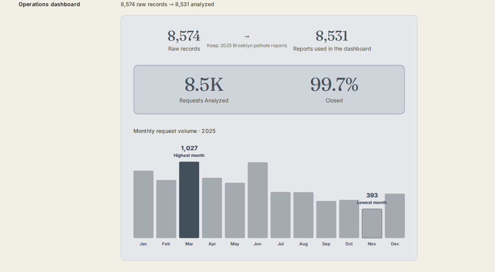

# NYC 311 Pothole Operations Dashboard

An independent analysis of NYC 311 pothole complaints, cleaning and validating public data to understand report volume, monthly patterns, and how quickly complaints were closed.

## What this project is

A self-directed data cleaning and analysis project using NYC's public
311 service request data, scoped to Brooklyn pothole reports from 2025.
It includes the full cleaning/validation pipeline (as Python scripts),
the resulting datasets, and the dashboard built to present the findings.

## Why I built it

I'm drawn to data because it can turn everyday problems into patterns
people can act on. Pothole reports interested me because this kind of
information can help cities understand demand, spot recurring issues,
and make better operational decisions.

## What I did

- Started with 8,574 raw records and narrowed them to 8,531 2025
  Brooklyn pothole reports by removing 40 Bridge Condition records and
  3 records from 2026.
- Checked the remaining reports for missing ZIP codes and date errors,
  including one report marked closed before it was created.
- Compared monthly report volume and closure times to see when
  complaints were highest and how quickly they were resolved.

## Tools used

Python · Pandas · Next.js · React · TypeScript

(This repo contains the Python/Pandas analysis. The dashboard shown
below is built with Next.js/React/TypeScript as part of my portfolio —
see the live link at the bottom.)

## Key findings

- **8,574 → 8,531** — raw records narrowed to the analytical scope
  after removing 40 Bridge Condition records and 3 records from 2026
- **99.7%** of scoped reports are Closed (8,509 of 8,531)
- **21.52 hours** median time to close (valid-closure records only)
- **March was the highest-volume month (1,027 reports)**; **November
  was the lowest (393 reports)**
- **38 distinct ZIP codes** represented; 81 records (0.9%) had no ZIP
  and were excluded from ZIP-level breakdowns only
- **1 report** had a Closed Date earlier than its Created Date —
  kept in the Closed count, excluded only from the time-to-close
  calculation

Full detail, including the complete data-quality table, is in
[`docs/methodology.md`](docs/methodology.md).

## Data / validation notes

- Source: [NYC Open Data — 311 Service Requests from 2020 to Present](https://data.cityofnewyork.us/d/erm2-nwe9)
- Scope: Agency = DOT, Borough = Brooklyn, Problem = Street Condition,
  Descriptor = Pothole, Created Date in calendar year 2025
- No operational result, improvement percentage, or business impact is
  claimed anywhere in this project — every number is a direct count or
  calculation from the source CSV, reproducible with the scripts below
- Full data-source documentation: [`data/DATA_SOURCE.md`](data/DATA_SOURCE.md)

## Dashboard



## How to reproduce this

```bash
git clone https://github.com/harjotsandhu24/nyc-311-pothole-operations-dashboard.git
cd nyc-311-pothole-operations-dashboard
pip install -r requirements.txt

cd analysis
python phase1_verify.py        # inspect the raw file
python phase1b_filter.py       # apply the scope filter -> scoped_2025_brooklyn_pothole.csv
python phase2_quality.py       # data quality / validation checks
python phase3_time_to_close.py # time-to-close calculation -> valid_closures.csv
python phase4_monthly_zip.py   # monthly volume + ZIP distribution
```

Each script prints its results to the terminal so they can be checked
against the numbers in this README and in `docs/methodology.md`.

## Live project
This analysis is presented as an interactive dashboard on my portfolio.

[View this project on my portfolio →](https://harjotsandhu.com/work/nyc-311-pothole-dashboard)
